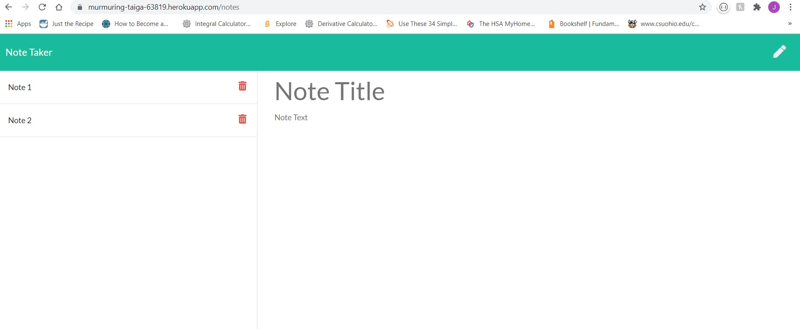

# Note_Taker1

## Description 

This is a CWRU coding bootcamp homework assignment practicing Node.js and express.  The project tests the students ability to incorporate the NPM express into their code.  The project practices the ability to get, post, and delete documents to a JSON and be able to store them and delete them.  The poject also incorporates the ability to deploy an app onto heroku.

AS A USER I would like a simple application that I can take notes digitally with.  I would like the notes to be saved onto the server and have the ability to be recalled and deleted. 

## Table of Contents

* [Installation](#installation)

* [Usage](#usage)

* [Contributions](#contributions)

* [Tests](#tests)

* [License](#license)

* [Questions](#questions)

* [Future](#future)

* [Contact](#contact)

## Installation
node.js, NPM express

## Usage
The project is used for taking notes

My Tests

Deployed Site

## Contributions
Jordan Rantucci

## Tests
This project uses express to save and store the information.

## License 
 

# Questions
See Contact Section

# Future
Update the styling to personalize the notebook

# Contact

GitHub username: jordanrantucci and Email address: jordanrantucci@gmail.com
